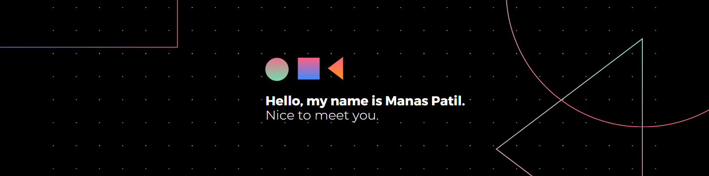

# 💫 About Me:
🚀 Hey there! I'm Manas Patil, a passionate software engineering student at Uka Tarsadia University in Gujarat, India, crafting innovative solutions with a focus on MERN stack, web development, and JavaScript magic. 💻✨  📚 I've also explored Python, C, Java, and more, mastering algorithms and software engineering principles.  🤝 Collaboration fuels my creativity; let's team up for greatness! 💪  ⏩ I'm diving into AI & ML, and mobile app development (Android & iOS), aiming for impactful solutions. 📱  🌈 Balancing work and play, I'm also into mobile and PC gaming, Badminton, and soccer. 🌲🎮  ✨ Let's connect and create magic together! Reach out at pmanas13092004@gmail.com or connect on [LinkedIn](https://www.linkedin.com/in/manas-patil-876718250/) 💌  Excited to collaborate and game on! 😊🚀

## 🌐 Socials:
  

# 💻 Tech Stack:
                                       
# 📊 GitHub Stats:
 
 

### ✍️ Random Dev Quote
